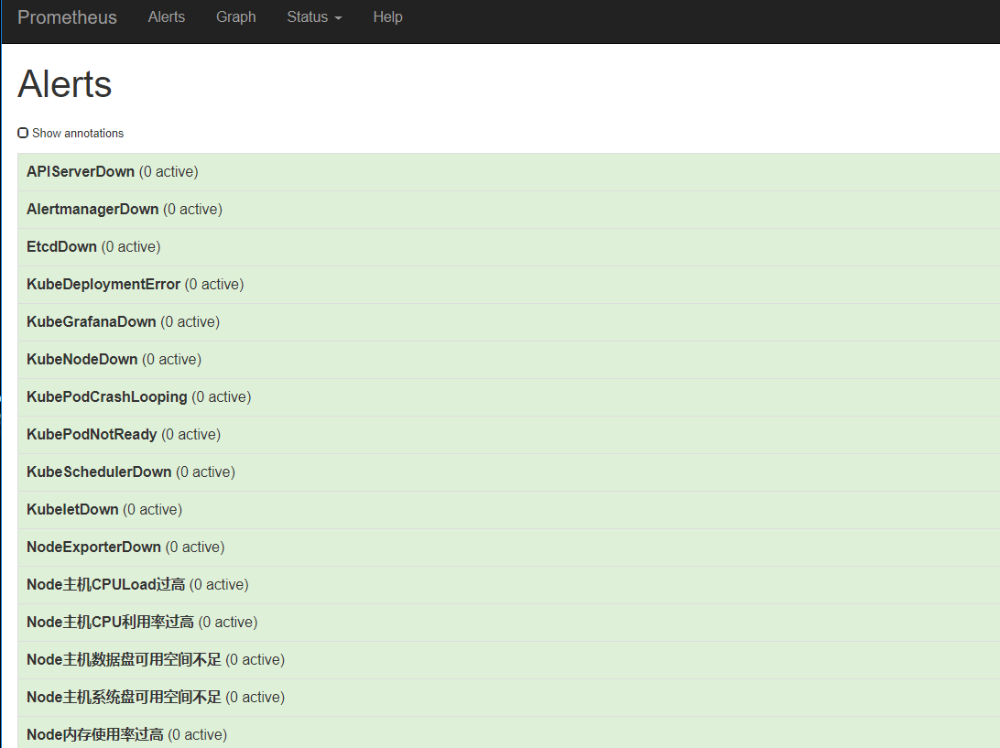
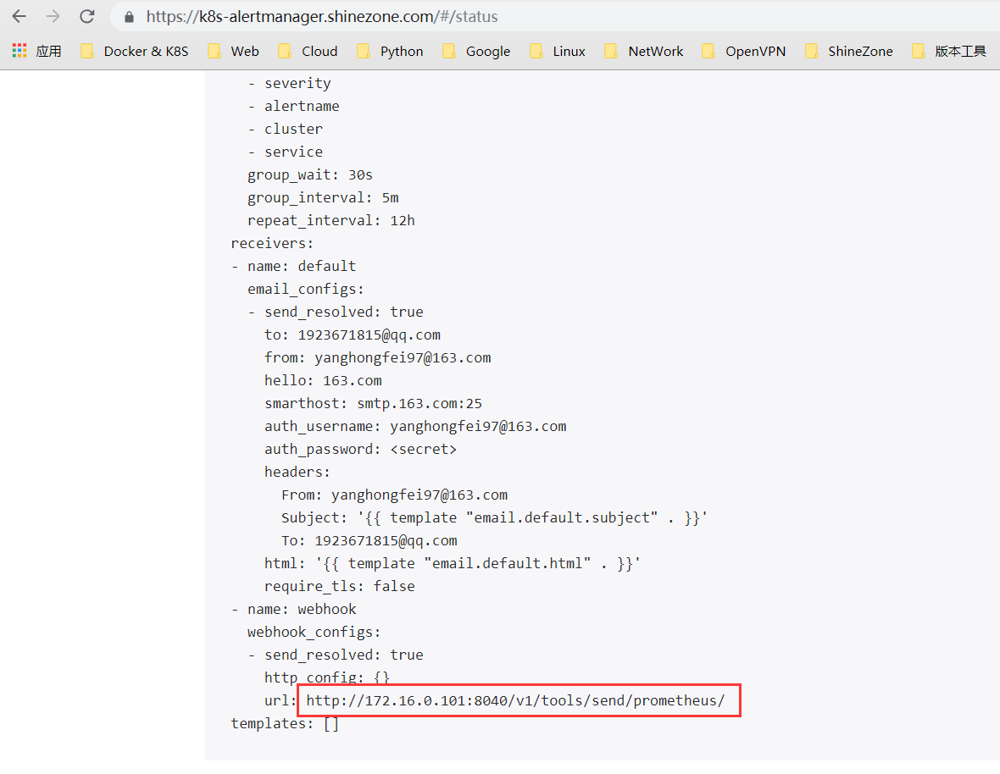
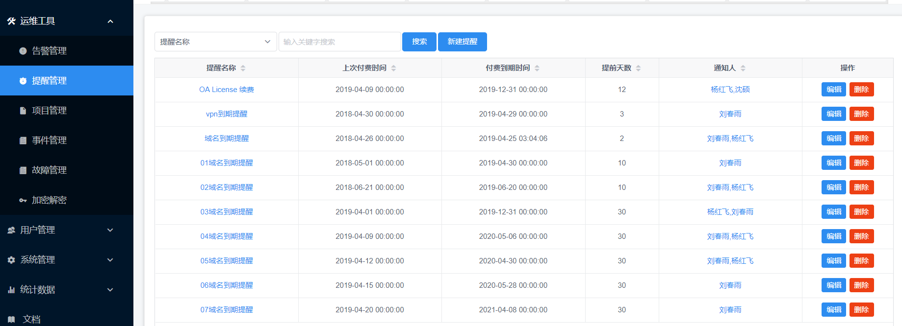
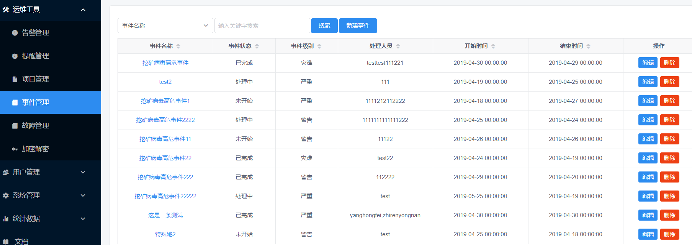

### 运维工具

> 实现一些运维场景中用到的记录及提醒功能，目前包含以下功能

**功能**

- 告警管理
- 提醒管理
- 项目管理
- 事件管理
- 故障管理
- 加密解密
- 随机密码
- 持续更新....


####  Demo

**告警管理**

> 对接Promethues  AlertManager WebHooks，平台控制哪些告警信息发送给哪些人。


示例参考






**提醒管理**




**项目管理**


**事件管理**




**故障管理**


#### 部署文档

**创建数据库**

```
create database `codo_tools` default character set utf8mb4 collate utf8mb4_unicode_ci;
```
**修改配置**

- 修改`settings.py`配置信息


**初始化表结构**

```
python3 db_sync.py
#也可以直接source doc/codo_tools.sql

```

**Docker部署方式（建议）**

- 修改`settings.py`配置文件信息，主要是MySQL和Redis配置
- 修改`doc/nginx_ops.conf` 域名地址
- Build 镜像 `docker build . -t codo_tools`
- 启动，`docker-compose up -d`
- 启动后默认端口：8040

- 启动后默认日志：
  - 服务日志：`/var/log/supervisor/tools.log`
  - 定时提醒：`/var/log/supervisor/cron_jobs.log`

**本地部署方式**

> 建议使用虚拟环境 具体参考Dockerfile 内的安装步骤

- 修改`settings.py`配置文件信息，主要是MySQL和Redis配置

- 安装依赖

```
pip3 install --user --upgrade pip
pip3 install -U git+https://github.com/ss1917/ops_sdk.git
pip3 install -r /var/www/codo-tools/doc/requirements.txt
```

- 从`doc`目录获取`supervisor`配置文件 使用 supervisor启动 `supervisorctl restart`

- 若启动多进程请使用nginx代理出来，可参看`doc/nginx_ops.conf`配置文件
- Debug参考`run.sh`文件，直接启动


### 服务注册

>  由于我们每个模板都是单独部署的，微服务需要在API网关进行注册

**示例**

```
rewrite_conf = {
    [gw_domain_name] = {
        rewrite_urls = {
            {
                uri = "/tools",
                rewrite_upstream = "tools.opendevops.cn:8040"  #nginx配置的域名
            },
            {
                uri = "/mg",
                rewrite_upstream = "mg.opendevops.cn:8010"
            },
            {
                uri = "/accounts",
                rewrite_upstream = "mg.opendevops.cn:8010"
            },
        }
    }
}
```

